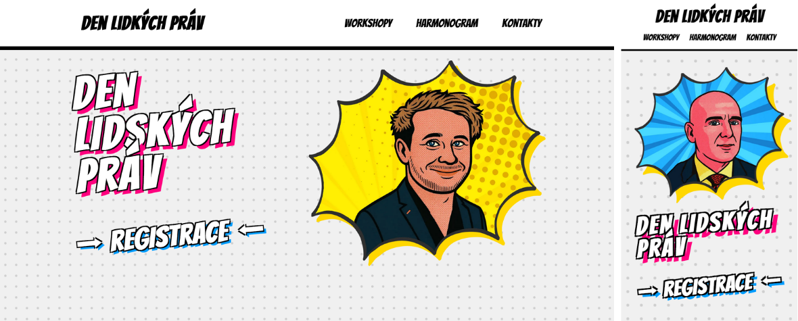

    

# Den lidských práv 2026 – Website

Official website for the **Den lidských práv** (Human Rights Day) event organized by our school [Čichnova Brno](https://www.cichnovabrno.cz/). The goal of this project is to provide participants with clear information, a schedule, and an easy way to register in one place.

## Try
- [CloudFlare pages](https://denlidskychprav.pages.dev/)
- [GitHub Pages](https://bag1s3k.github.io/human-rights-day-2026/)

## Design

The chosen design style for the event is pop-art / comic style.

  

